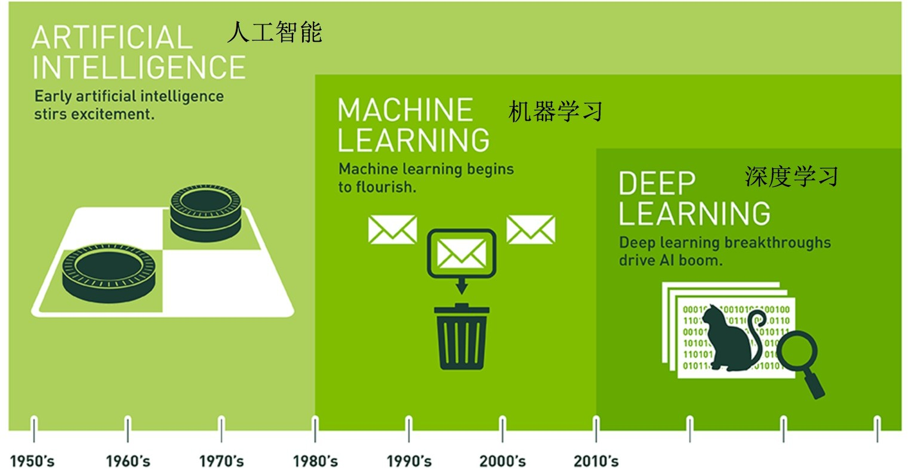

# 一、机器学习概述

## 1、人工智能概述

 1、人工智能应用场景


2、人工智能小案例

案例一：快速涂鸦，你画我猜

参考链接：[https://quickdraw.withgoogle.com](https://quickdraw.withgoogle.com/)


案例二：实时对象检测

参考链接：<https://pjreddie.com/darknet/yolo/>


案例三：风格迁移

查看更多：<https://deepdreamgenerator.com/>


3、人工智能发展必备三要素：

* 数据
* 算法
* 计算力
  * CPU
  * GPU
  * TPU


计算力之 CPU、GPU 对比：

* CPU 主要适合 IO 密集型的任务
* GPU 主要适合计算密集型任务

提问：什么类型的程序适合在 **GPU** 上运行？

1.  计算密集型的程序。

所谓计算密集型 (Compute-intensive) 的程序，就是其大部分运行时间花在了寄存器运算上，寄存器的速度和处理器的速度相当，从寄存器读写数据几乎没有延时。可以做一下对比，读内存的延迟大概是几百个时钟周期；读硬盘的速度就不说了，即便是 SSD，也实在是太慢了。

2.  易于并行的程序。

GPU 其实是一种 SIMD (Single Instruction Multiple Data) 架构，它有成百上千个核，每一个核在同一时间最好能做同样的事情。

CPU 和 GPU 的区别： <http://www.sohu.com/a/201309334_468740> 

Google TPU 介绍：<https://buzzorange.com/techorange/2017/09/27/what-intel-google-nvidia-microsoft-do-for-ai-chips/>

4、人工智能、机器学习和深度学习




人工智能和机器学习，深度学习的关系

* 机器学习是人工智能的一个实现途径
* 深度学习是机器学习的一个方法发展而来

> 总结：
>
> 1. 人工智能应用场景
>    * 网络安全、电子商务、计算模拟、社交网络 ... \...
>
> 2. 人工智能必备三要素
>    * 数据、算法、计算力
>
> 3. 人工智能、机器学习和深度学习的关系
>    * 机器学习是人工智能的一个实现途径
>    * 深度学习是机器学习的一个方法发展而来

## 2、人工智能发展历程

### 2.1、人工智能的起源

1、图灵测试

测试者与被测试者（一个人和一台机器）隔开的情况下，通过一些装置（如键盘）向被测试者随意提问。

多次测试（一般为 5 min 之内），如果有超过 30% 的测试者不能确定被测试者是人还是机器，那么这台机器就通过了测试，并被认为具有人类智能。


2、达特茅斯会议

1956 年 8 月，在美国汉诺斯小镇宁静的达特茅斯学院中，约翰·麦卡锡（John McCarthy）、马文·闵斯基（Marvin  Minsky，人工智能与认知学专家）、克劳德·香农（Claude Shannon，信息论的创始人）、艾伦·纽厄尔（Allen  Newell，计算机科学家）、赫伯特·西蒙（Herbert Simon，诺贝尔经济学奖得主）等科学家正聚在一起，讨论着一个完全不食人间烟火的主题：用机器来模仿人类学习以及其他方面的智能。

会议足足开了两个月的时间，虽然大家没有达成普遍的共识，但是却为会议讨论的内容起了一个名字：**人工智能**

因此，**1956** 年也就成为了人工智能元年。

### 2.2、发展历程

人工智能充满未知的探索道路曲折起伏。如何描述人工智能自 1956 年以来 60 余年的发展历程，学术界可谓仁者见仁、智者见智。我们将人工智能的发展历程划分为以下 6 个阶段：

* 第一是起步发展期：1956 年 —— 20 世纪 60 年代初。

人工智能概念提出后，相继取得了一批令人瞩目的研究成果，如机器定理证明、跳棋程序等，掀起人工智能发展的第一个高潮。

* 第二是反思发展期：20 世纪 60 年代 —— 70 年代初。

人工智能发展初期的突破性进展大大提升了人们对人工智能的期望，人们开始尝试更具挑战性的任务，并提出了一些不切实际的研发目标。然而，接二连三的失败和预期目标的落空（例如，无法用机器证明两个连续函数之和还是连续函数、机器翻译闹出笑话等），使人工智能的发展走入低谷。

* 第三是应用发展期：20 世纪 70 年代初 —— 80年代中。

20 世纪 70 年代出现的专家系统模拟人类专家的知识和经验解决特定领域的问题，实现了人工智能从理论研究走向实际应用、从一般推理策略探讨转向运用专门知识的重大突破。专家系统在医疗、化学、地质等领域取得成功，推动人工智能走入应用发展的新高潮。

* 第四是低迷发展期：20 世纪 80 年代中 —— 90 年代中。

随着人工智能的应用规模不断扩大，专家系统存在的应用领域狭窄、缺乏常识性知识、知识获取困难、推理方法单一、缺乏分布式功能、难以与现有数据库兼容等问题逐渐暴露出来。

* 第五是稳步发展期：20 世纪 90 年代中 —— 2010 年。

由于网络技术特别是互联网技术的发展，加速了人工智能的创新研究，促使人工智能技术进一步走向实用化。1997 年国际商业机器公司（简称 IBM）深蓝超级计算机战胜了国际象棋世界冠军卡斯帕罗夫，2008 年 IBM 提出 "智慧地球" 的概念。以上都是这一时期的标志性事件。

* 第六是蓬勃发展期：2011 年至今。

随着大数据、云计算、互联网、物联网等信息技术的发展，泛在感知数据和图形处理器等计算平台推动以深度神经网络为代表的人工智能技术飞速发展，大幅跨越了科学与应用之间的"技术鸿沟"，诸如图像分类、语音识别、知识问答、人机对弈、无人驾驶等人工智能技术实现了从"不能用、不好用"到"可以用"的技术突破，迎来爆发式增长的新高潮。


### 2.3、小结

人工智能的起源：

* 图灵测试
* 达特茅斯会议

人工智能的发展经历了六个阶段：

* 起步发展期
* 反思发展期
* 应用发展期
* 低迷发展期
* 稳步发展期
* 蓬勃发展期

## 3、人工智能主要分支

通讯、感知与行动是现代人工智能的三个关键能力，在这里我们将根据这些能力 / 应用对这三个技术领域进行介绍：

* 计算机视觉（**CV**）
* 自然语言处理（**NLP**）
  * 在 NLP 领域中，将覆盖文本挖掘 / 分类、机器翻译和语音识别。
* 机器人

### 3.1、分支一：计算机视觉

计算机视觉（**CV**）是指机器感知环境的能力。这一技术类别中的经典任务有图像形成、图像处理、图像提取和图像的三维推理。物体检测和人脸识别是其比较成功的研究领域。

当前阶段：

计算机视觉现已有很多应用，这表明了这类技术的成就，也让我们将其归入到应用阶段。随着深度学习的发展，机器甚至能在特定的案例中实现超越人类的表现。但是，这项技术离社会影响阶段还有一定距离，那要等到机器能在所有场景中都达到人类的同等水平才行（感知其环境的所有相关方面）

发展历史：


### 3.2、分支二：语音识别

语音识别是指识别语音（说出的语言）并将其转换成对应文本的技术。相反的任务（文本转语音 / TTS）也是这一领域内一个类似的研究主题。

当前阶段：

语音识别已经处于应用阶段很长时间了。最近几年，随着大数据和深度学习技术的发展，语音识别进展颇丰，现在已经非常接近社会影响阶段了。

语音识别领域仍然面临着**声纹识别**和「鸡尾酒会效应」等一些特殊情况的难题。

现代语音识别系统严重依赖于云，在离线时可能就无法取得理想的工作效果。

发展历史：


### 3.3、分支三：文本挖掘**/**分类

这里的文本挖掘主要是指文本分类，该技术可用于理解、组织和分类结构化或非结构化文本文档。其涵盖的主要任务有句法分析、情绪分析和垃圾信息检测。

当前阶段：

我们将这项技术归类到应用阶段，因为现在有很多应用都已经集成了基于文本挖掘的情绪分析或垃圾信息检测技术。文本挖掘技术也在智能投顾的开发中有所应用，并且提升了用户体验。

文本挖掘和分类领域的一个瓶颈出现在歧义和有偏差的数据上。

发展历史：


### 3.4、分支四：机器翻译

机器翻译（MT）是利用机器的力量自动将一种自然语言（源语言）的文本翻译成另一种语言（目标语言）

当前阶段：

机器翻译是一个见证了大量发展历程的应用领域。该领域最近由于神经机器翻译而取得了非常显著的进展，但仍然没有全面达到专业译者的水平；但是，我们相信在大数据、云计算和深度学习技术的帮助下，机器翻译很快就将进入社会影响阶段。

在某些情况下，俚语和行话等内容的翻译会比较困难（受限词表问题）。

专业领域的机器翻译**(**比如医疗领域**)**表现通常不好。

发展历史：


### 3.5、分支五：机器人

机器人学（Robotics）研究的是机器人的设计、制造、运作和应用，以及控制它们的计算机系统、传感反馈和信息处理。

机器人可以分成两大类：固定机器人和移动机器人。固定机器人通常被用于工业生产（比如用于装配线）。常见的移动机器人应用有货运机器人、空中机器人和自动载具。机器人需要不同部件和系统的协作才能实现最优的作业。其中在硬件上包含传感器、反应器和控制器；另外还有能够实现感知能力的软件，比如定位、地图测绘和目标识别。

当前阶段：

自上世纪「Robot」一词诞生以来，人们已经为工业制造业设计了很多机器人。工业机器人是增长最快的应用领域，它们在 20 世纪 80 年代将这一领域带入了应用阶段。在安川电机、Fanuc、ABB、库卡等公司的努力下，我们认为进入 21 世纪之后，机器人领域就已经进入了社会影响阶段，此时各种工业机器人已经主宰了装配生产线。此外，软体机器人在很多领域也有广泛的应用，比如在医疗行业协助手术或在金融行业自动执行承销过程。

但是，法律法规和「机器人威胁论」可能会妨碍机器人领域的发展。还有设计和制造机器人需要相对较高的投资。

发展历史：


总的来说，人工智能领域的研究前沿正逐渐从搜索、知识和推理领域转向机器学习、深度学习、计算机视觉和机器人领域。

大多数早期技术至少已经处于应用阶段了，而且其中一些已经显现出了社会影响力。一些新开发的技术可能仍处于工程甚至研究阶段，但是我们可以看到不同阶段之间转移的速度变得越来越快。

> 小结：
>
> 人工智能主要分支
>
> * 计算机视觉
> * 语音识别
> * 文本挖掘 / 分类
> * 机器翻译
> * 机器人

## 4、机器学习工作流程

### 4.1、概述

**什么是机器学习**？

机器学习是从数据中自动分析获得模型，并利用模型对未知数据进行预测。


**机器学习工作流程**

1.  获取数据

2.  数据基本处理

3.  特征工程

4.  机器学习**(**模型训练**)**

5.  模型评估
    * 结果达到要求，上线服务
    * 没有达到要求，重新上面步骤


### 4.2、获取到的数据集介绍

房屋价格预测


判断电影类型


按不同方式将人物归类


1、数据简介

在数据集中一般：

* 一行数据我们称为一个样本
* 一列数据我们成为一个特征
* 有些数据有目标值（标签值），有些数据没有目标值（如上表中，电影类型就是这个数据集的目标值）

2、数据类型构成：

* 数据类型一：特征值 + 目标值（目标值是连续的和离散的）
* 数据类型二：只有特征值，没有目标值

3、数据分割：

机器学习一般的数据集会划分为两个部分：

* 训练数据：用于训练，构建模型

* 测试数据：在模型检验时使用，用于评估模型是否有效

4、划分比例：

* 训练集：70% 80% 75%

* 测试集：30% 20% 25%

### 4.3、数据基本处理

即对数据进行缺失值、去除异常值等处理

### 4.4、特征工程

#### 什么是特征工程

特征工程（Feature Engineering）是使用专业背景知识和技巧处理数据，使得特征能在机器学习算法上发挥更好的作用的过程。

意义：会直接影响机器学习的效果

#### 为什么需要特征工程

> 机器学习领域的大神 Andrew Ng（吴恩达）老师说："Coming up with features is difficult, time-consuming, requires expert knowledge. "Applied machine learning" is basically feature engineering. "
>
> 注：业界广泛流传：数据和特征决定了机器学习的上限，而模型和算法只是逼近这个上限而已。

#### 特征工程包含内容

* 特征提取
* 特征预处理
* 特征降维

#### 各概念具体解释

1、特征提取

将任意数据（如文本或图像）转换为可用于机器学习的数字特征


2、特征预处理

通过一些转换函数将特征数据转换成更加适合算法模型的特征数据过程


3、特征降维

指在某些限定条件下，降低随机变量**(**特征**)**个数，得到一组**"**不相关**"**主变量的过程


### 4.5、机器学习

选择合适的算法对模型进行训练（具体内容见 [5、机器学习算法分类](#5、机器学习算法分类)）

### 4.6、模型评估

对训练好的模型进行评估（具体内容见 [6、模型评估](#6、模型评估)）

>  拓展阅读：[完整机器学习项目的流程](#1、完整机器学习项目的流程)

### 4.7、小结

1、机器学习定义

机器学习是从数据中自动分析获得模型，并利用模型对未知数据进行预测

2、机器学习工作流程总结

1.  获取数据
2.  数据基本处理
3.  特征工程
4.  机器学习**(**模型训练**)**
5.  模型评估
    * 结果达到要求，上线服务
    * 没有达到要求，重新上面步骤

3、获取到的数据集介绍

* 数据集中一行数据一般称为一个样本，一列数据一般称为一个特征。
* 数据集的构成：
  * 由特征值+目标值（部分数据集没有）构成
* 为了模型的训练和测试，把数据集分为：
  * 训练数据（70% ~ 80%）和测试数据（20% ~ 30%）

4、特征工程包含内容

* 特征提取
* 特征预处理
* 特征降维

## 5、机器学习算法分类

根据数据集组成不同，可以把机器学习算法分为：

* 监督学习
* 无监督学习
* 半监督学习
* 强化学习

### 5.1、监督学习

定义：输入数据是由输入特征值和目标值所组成。

* 函数的输出可以是一个连续的值（称为回归）
* 或者输出是有限个离散值（称作分类）

#### 回归问题

例如：预测房价，根据样本集拟合出一条连续曲线。


#### 分类问题

例如：根据肿瘤特征判断良性还是恶性，得到的是结果是"良性"或者"恶性"，是离散的。


### 5.2、无监督学习

定义：输入数据是由输入特征值组成，没有目标值

* 输入数据没有被标记，也没有确定的结果。样本数据类别未知；
* 需要根据样本间的相似性对样本集进行类别划分。

举例：


> 有监督与无监督算法对比：


### 5.3、半监督学习

定义：训练集同时包含有标记样本数据和未标记样本数据。

举例：

* 监督学习训练方式：


* 半监督学习训练方式：


### 5.4、强化学习

定义：实质是 make decisions 问题，即自动进行决策，并且可以做连续决策。

举例：

小孩想要走路，但在这之前，他需要先站起来，站起来之后还要保持平衡，接下来还要先迈出一条腿，是左腿还是右腿，迈出一步后还要迈出下一步。

小孩就是 **agent**，他试图通过采取行动（即行走）来操纵环境（行走的表面），并且从一个状态转变到另一个状态（即他走的每一步），当他完成任务的子任务（即走了几步）时，孩子得到奖励（给巧克力吃），并且当他不能走路时，就不会给巧克力。

> 主要包含五个元素：agent, action, reward, environment, observation；


> 强化学习的目标就是获得最多的累计奖励。

监督学习和强化学习的对比：


|          |                           监督学习                           |                           强化学习                           |
| -------- | :----------------------------------------------------------: | :----------------------------------------------------------: |
| 反馈映射 | 输出的是之间的关系，可以告诉算法什么样的输入对应着什么样的输出 | 输出的是给机器的反馈 reward function，即用来判断这个行为是好是坏 |
| 反馈时间 |               做了比较坏的选择会立刻反馈给算法               | 结果反馈有延时，有时候可能需要走了很多步以后才知道以前的某一步的选择是好还是坏 |
| 输入特征 |                      输入是独立同分布的                      | 面对的输入总是在变化，每当算法做出一个行为，它影响下一次决策的输入 |

拓展概念：[独立同分布概念](#2、独立同分布)

拓展阅读：Alphago 进化史 漫画告诉你 Zero 为什么这么牛：<http://sports.sina.com.cn/chess/weiqi/2017-10-21/doc-ifymyyxw4023875.shtml>

### 5.5、小结


|                                      |           In           |    Out     |        目的        |         案例         |
| :----------------------------------- | :--------------------: | :--------: | :----------------: | :------------------: |
| 监督学习(supervised learning)        |         有标签         |   有反馈   |      预测结果      |  猫狗分类、房价预测  |
| 无监督学习(unsupervised learning)    |         无标签         |   无反馈   |    发现潜在结构    | "物以类聚，人以群分" |
| 半监督学习(Semi-Supervised Learning) | 部分有标签，部分无标签 |   有反馈   | 降低数据标记的难度 |                      |
| 强化学习(reinforcement learning)     |   决策流程及激励系统   | 一系列行动 |   长期利益最大化   |        学下棋        |

## 6、模型评估

模型评估是模型开发过程不可或缺的一部分。它有助于发现表达数据的最佳模型和所选模型将来工作的性能如何。

按照数据集的目标值不同，可以把模型评估分为分类模型评估和回归模型评估。

### 6.1、分类模型评估


评价指标：

准确率：预测正确的数占样本总数的比例。

其他评价指标：精确率、召回率、F1-score、AUC 指标等

### 6.2、回归模型评估


评价指标：

均方根误差（Root Mean Squared Error，RMSE）：RMSE 是一个衡量回归模型误差率的常用公式。不过，它仅能比较误差是相同单位的模型。


举例：

假设上面的房价预测，只有五个样本，

对应的真实值为：100，120，125，230，400

预测值为：105，119，120，230，410

那么使用均方根误差求解得：
$$
RMSE = √ [(100 − 105)^2 + (120 − 119)^2 + 5^2 + 0^2 + 10^2] / 5 = 5.495
$$
其他评价指标：

* 相对平方误差（Relative Squared Error，RSE）
* 平均绝对误差（Mean Absolute Error，MAE）
* 相对绝对误差（Relative Absolute Error，RAE）

### 6.3、拟合

模型评估用于评价训练好的的模型的表现效果，其表现效果大致可以分为两类：过拟合、欠拟合。

在训练过程中，你可能会遇到如下问题：

训练数据训练的很好，误差也不大，为什么在测试集上面有问题呢？

当算法在某个数据集当中出现这种情况，可能就出现了拟合问题。

#### 欠拟合


因为机器学习到的天鹅特征太少了，导致区分标准太粗糙，不能准确识别出天鹅。

欠拟合（under-fitting）：模型学习的太过粗糙，连训练集中的样本数据特征关系都没有学出来。

#### 过拟合


机器已经基本能区别天鹅和其他动物了。然后，很不巧已有的天鹅图片全是白天鹅的，于是机器经过学习后，会认为天鹅的羽毛都是白的，以后看到羽毛是黑的天鹅就会认为那不是天鹅。

过拟合（over-fitting）：所建的机器学习模型或者是深度学习模型在训练样本中表现得过于优越，导致在测试数据集中表现不佳。

所以训练数据训练的很好，误差也不大，为什么在测试集上面有问题呢？就是出现了过拟合

> 欠拟合：
>
> * 学习到的东西太少
> * 模型学习的太过粗糙
>
> 过拟合：
>
> * 学习到的东西太多
> * 学习到的特征多，不好泛化

## 7、Azure 机器学习模型搭建实验

**Azure** 平台简介


Azure Machine Learning（简称 "AML"）是微软在其公有云 Azure 上推出的基于 Web 使用的一项机器学习服务，机器学习属人工智能的一个分支，它借助算法让电脑对大量流动数据集进行识别。这种方式能够通过历史数据来预测未来事件和行为，其实现方式明显优于传统的商业智能形式。

微软的目标是简化使用机器学习的过程，以便于开发人员、业务分析师和数据科学家进行广泛、便捷地应用。这款服务的目的在于"将机器学习动力与云计算的简单性相结合"。

AML 目前在微软的 Global Azure 云服务平台提供服务，用户可以通过站点：<https://studio.azureml.net/> 申请免费试用。


Azure 机器学习实验

实验目的：了解机器学习从数据到建模并最终评估预测的整个流程。

具体实验过程见 PDF 文件《Azure机器学习模型搭建实验》

## 8、深度学习简介

### 神经网络简介

深度学习（Deep Learning），也称为深度结构学习（Deep Structured Learning）、层次学习（Hierarchical Learning）或者是深度机器学习（Deep Machine Learning）。深度学习是一类算法集合，是机器学习的一个分支。


深度学习方法近年来，在会话识别、图像识别和对象侦测等领域表现出了惊人的准确性。

但是，"深度学习" 这个词语很古老，它在 1986 年由 Dechter 在机器学习领域提出，然后在 2000 年由 Aizenberg 等人引入到人工神经网络中。如今由于 Alex Krizhevsky 在 2012 年使用卷积网络结构赢得了 ImageNet 比赛之后受到大家的瞩目。

卷积网络之父：Yann LeCun


深度学习演示：[http://playground.tensorflow.org](http://playground.tensorflow.org/)


### 深度学习各层负责内容

以图片区分为例

第 1 层：负责识别颜色及简单纹理


第 2 层：一些神经元可以识别更加细化的纹理，布纹，刻纹，叶纹等


第 3 层：一些神经元负责感受黑夜里的黄色烛光，高光，萤火，鸡蛋黄色等。


第 4 层：一些神经元识别萌狗的脸，宠物形貌，圆柱体事物，七星瓢虫等的存在。


第 5 层：一些神经元负责识别花，黑眼圈动物，鸟，键盘，原型屋顶等。


> 深度学习的发展源头——神经网络
>
> 多层神经网络，在最初几层是识别简单内容，后面几层是识别一些复杂内容

# 二、Jupyter Notebook

> 整个机器学习基础阶段还会用到 Matplotlib、Numpy、Pandas 等库
>
> 注意：每个包安装的过程中，尽量指定稳定版本进行安装

## 1、Jupyter Notebook 介绍

Jupyter 项目是一个非盈利的开源项目，源于 2014 年的 ipython 项目，逐渐发展为支持跨所有编程语言的交互式数据科学和科学计算

* Jupyter Notebook，原名 IPython Notbook，是 IPython 的加强网页版，一个开源 Web 应用
* 程序名字源自 Julia、Python 和 R（数据科学的三种开源语言）
* 是一款程序员和科学工作者的编程 / 文档 / 笔记 / 展示软件
* .ipynb 文件格式是用于计算型叙述的 JSON 文档格式的正式规范


## 2、为什么使用 Jupyter Notebook

* 传统软件开发：工程／目标明确
  * 需求分析，设计架构，开发模块，测试
* 数据挖掘：艺术／目标不明确
  * 目的是具体的洞察目标，而不是机械的完成任务
  * 通过执行代码来理解问题
  * 迭代式地改进代码来改进解决方法

实时运行的代码、叙事性的文本和可视化被整合在一起，方便使用代码和数据来讲述故事

对比 Jupyter Notebook 和 Pycharm

画图：


数据展示：


> Jupyter Notebook 相比 Pycharm 在画图和数据展示方面更有优势。

## 3、Jupyter Notebook 的使用—helloworld

### 3.1、界面启动、创建文件

1、界面启动

环境搭建好后，本机输入 `jupyter notebook` 命令，会自动弹出浏览器窗口打开 Jupyter Notebook

本地 notebook 的默认 URL 为：http://localhost:8888

想让 notebook 打开指定目录，只要进入此目录后执行命令即可


2、新建 notebook 文档

notebook 的文档格式是 .ipynb


3、内容界面操作

标题栏：点击标题（如 Untitled）修改文档名

编辑栏：


### 3.2、cell 操作

什么是 cell？

**cell**：一对 In Out 会话被视作一个代码单元，称为 cell

cell 行号前的 * 表示代码正在运行

Jupyter 支持两种模式：

1. 编辑模式（Enter）
   * 命令模式下回车 Enter 或鼠标双击 cell 进入编辑模式
   * 可以操作 cell 内文本或代码，剪切 / 复制 / 粘贴移动等操作
2. 命令模式（Esc）
   * 按 Esc 退出编辑，进入命令模式
   * 可以操作 cell 单元本身进行剪切 / 复制 / 粘贴 / 移动等操作

#### 鼠标操作


#### 快捷键操作

两种模式通用快捷键：

* Shift+Enter，执行本单元代码，并跳转到下一单元
* Ctrl+Enter，执行本单元代码，留在本单元

命令模式：按 ESC 进入

* Y，cell 切换到 Code 模式

* M，cell 切换到 Markdown 模式

* A，在当前 cell 的上面添加 cell

* B，在当前 cell 的下面添加 cell

其他（了解）

* 双击 D：删除当前 cell

* Z，回退

* L，为当前 cell 加上行号 \<!\--

* Ctrl+Shift+P，对话框输入命令直接运行

* Crtl+Home，快速跳转到首个 cell

* Crtl+End，快速跳转到最后一个 cell

编辑模式：按 Enter 进入

* 补全代码：变量、方法后跟 Tab 键

* 为一行或多行代码添加 / 取消注释：Ctrl + /（Mac：CMD + /）

其他（了解）：

* 多光标操作： Ctrl 键点击鼠标（Mac：CMD + 点击鼠标）
* 回退：Ctrl + Z（Mac：CMD + Z）
* 重做：Ctrl + Y（Mac：CMD + Y）

### 3.3、markdown 演示

> 掌握标题和缩进即可


## 4、自动补全代码等相关功能拓展【了解】

效果展示：


安装 jupyter_contrib_nbextensions 库的命令如下：

```shell
python -m pip install jupyter_contrib_nbextensions
```

然后执行：

```shell
jupyter contrib nbextension install --user --skip-running-check
```

在原来的基础上勾选："Table of Contents" 以及 "Hinterland"

部分功能：


## 5、小结

1、Jupyter Notebook 是什么

* 是一个 ipython 的 web 加强版

2、为什么要使用 Jupyter

* 用于数据探索过程

3、怎么用 Jupyter

* 通过 `jupyter notebook` 命令就可以使用
* 保存文件是 .ipynb
* 每个内容，都对应的是一个 cell

4、Jupyter 的快捷键

* Shift + Enter，执行本单元代码，并跳转到下一单元
* Ctrl + Enter，执行本单元代码，留在本单元


# 拓展知识

## 1、完整机器学习项目的流程

### 1.1、抽象成数学问题

明确问题是进行机器学习的第一步。机器学习的训练过程通常都是一件非常耗时的事情，胡乱尝试时间成本是非常高的。

这里的抽象成数学问题，指的明确我们可以获得什么样的数据，抽象出的问题，是一个分类还是回归或者是聚类的问题。

### 1.2、获取数据

数据决定了机器学习结果的上限，而算法只是尽可能逼近这个上限。

数据要有代表性，否则必然会过拟合。

而且对于分类问题，数据偏斜不能过于严重，不同类别的数据数量不要有数量级的差距。

而且还要对数据的量级有一个评估，多少个样本，多少个特征，可以估算出其对内存的消耗程度，判断训练过程中内存是否能够放得下。如果放不下就得考虑改进算法或者使用一些降维的技巧了。如果数据量实在太大，那就要考虑分布式了。

### 1.3、特征预处理与特征选择

良好的数据要能够提取出良好的特征才能真正发挥作用。

特征预处理、数据清洗是很关键的步骤，往往能够使得算法的效果和性能得到显著提高。归一化、离散化、因子化、缺失值处理、去除共线性等，数据挖掘过程中很多时间就花在它们上面。这些工作简单可复制，收益稳定可预期，是机器学习的基础必备步骤。

筛选出显著特征、摒弃非显著特征，需要机器学习工程师反复理解业务。这对很多结果有决定性的影响。特征选择好了，非常简单的算法也能得出良好、稳定的结果。这需要运用特征有效性分析的相关技术，如相关系数、卡方检验、平均互信息、条件熵、后验概率、逻辑回归权重等方法。

### 1.4、训练模型与调优

直到这一步才用到我们上面说的算法进行训练。现在很多算法都能够封装成黑盒供人使用。但是真正考验水平的是调整这些算法的（超）参数，使得结果变得更加优良。这需要我们对算法的原理有深入的理解。理解越深入，就越能发现问题的症结，提出良好的调优方案。

### 1.5、模型诊断

如何确定模型调优的方向与思路呢？这就需要对模型进行诊断的技术。

过拟合、欠拟合判断是模型诊断中至关重要的一步。常见的方法如交叉验证，绘制学习曲线等。过拟合的基本调优思路是增加数据量，降低模型复杂度。欠拟合的基本调优思路是提高特征数量和质量，增加模型复杂度。

误差分析也是机器学习至关重要的步骤。通过观察误差样本全面分析产生误差的原因：是参数的问题还是算法选择的问题，是特征的问题还是数据本身的问题......

诊断后的模型需要进行调优，调优后的新模型需要重新进行诊断，这是一个反复迭代不断逼近的过程，需要不断地尝试，进而达到最优状态。

### 1.6、模型融合

一般来说，模型融合后都能使得效果有一定提升。而且效果很好。

工程上，主要提升算法准确度的方法是分别在模型的前端（特征清洗和预处理，不同的采样模式）与后端（模型融合）上下功夫。因为他们比较标准可复制，效果比较稳定。而直接调参的工作不会很多，毕竟大量数据训练起来太慢了，而且效果难以保证。

### 1.7、上线运行

这一部分内容主要跟工程实现的相关性比较大。工程上是结果导向，模型在线上运行的效果直接决定模型的成败。
不单纯包括其准确程度、误差等情况，还包括其运行的速度（时间复杂度）、资源消耗程度（空间复杂度）、稳定性是否可接受。

这些工作流程主要是工程实践上总结出的一些经验。并不是每个项目都包含完整的一个流程。这里的部分只是一个指导性的说明，只有大家自己多实践，多积累项目经验，才会有自己更深刻的认识。

## 2、独立同分布

IID（independent and identically distributed）

### 2.1、独立同分布（i.i.d.）

在概率统计理论中，如果变量序列或者其他随机变量有相同的概率分布，并且互相独立，那么这些随机变量是独立同分布。

在西瓜书中解释是：输入空间中的所有样本服从一个隐含未知的分布，训练数据所有样本都是独立地从这个分布上采样而得。

### 2.2、简单解释 —— 独立、同分布、独立同分布

1.  独立：每次抽样之间没有关系，不会相互影响

举例：给一个骰子，每次抛骰子抛到几就是几，这是独立；如果我要抛骰子两次之和大于 8，那么第一次和第二次抛就不独立，因为第二次抛的结果和第一次相关。

2.  同分布：每次抽样，样本服从同一个分布

举例：给一个骰子，每次抛骰子得到任意点数的概率都是六分之一，这个就是同分布

3.  独立同分布：i.i.d.，每次抽样之间独立而且同分布

### 2.3、机器学习领域的重要假设

IID 独立同分布即假设训练数据和测试数据是满足相同分布的，它是通过训练数据获得的模型能够在测试集获得好的效果的一个基本保障。

### 2.4、目前发展

机器学习并不总要求独立同分布，在不少问题中要求样本数据采样自同一个分布是因为希望用训练数据集得到的模型可以合理的用于测试数据集，使用独立同分布假设能够解释得通。

目前一些机器学习内容已经不再囿于独立同分布假设下，一些问题会假设样本没有同分布。